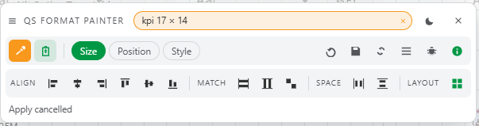

# qs-format-painter

A developer tool for Qlik Sense. Copy size, position and style from one object to another, and align or distribute several objects at once, including inside layout containers.

Building a sheet usually means dragging objects until they look right, then repeating the same appearance settings on every chart. QS Format Painter removes that work. Pick a source object, select the targets, apply.

Video showing how it works : https://lnkd.in/p/eDVe63rg

## Features
- Copy size (width and height) between objects
- Copy position, or apply an offset from the source object
- Copy style properties such as background, borders, shadows, title formatting
- Align selected objects left, right, top, bottom, or on their center axis
- Distribute objects evenly, horizontally or vertically
- Works on objects placed inside a layout container, not only on the sheet grid
- Multi-selection, so one source can be applied to many targets in a single action

## Installation
 
### Qlik Sense Client-Managed
 
1. Download the latest `qs-format-painter.zip`
2. Open the QMC, go to **Extensions**, then **Import**.
3. Select the zip file and confirm.
### Qlik Sense Enterprise SaaS / Qlik Cloud
 
1. Download the latest `qs-format-painter.zip`
2. In the Management Console, go to **Extensions**, then **Add**.
3. Upload the zip file.
You can also drop the unzipped folder into `C:\Users\<user>\Documents\Qlik\Sense\Extensions\` for Qlik Sense Desktop.

## Contributing
 
Issues and pull requests are welcome. If you report a bug, please include your Qlik Sense version and the type of object involved.
 
## Author
Idriss Benbassou — [idriss-benbassou.com](https://idriss-benbassou.com)
